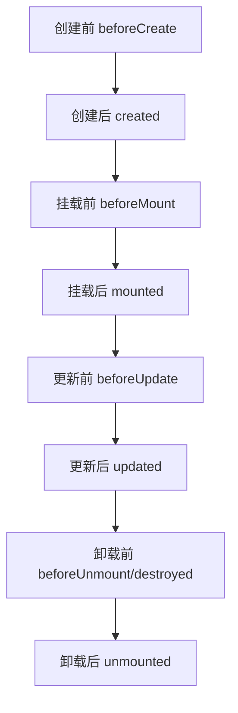

# Vue3生命周期与钩子函数

> 本章系统梳理Vue3的生命周期流程、各生命周期钩子的作用与用法，涵盖Options API与Composition API的对比，配合实战代码、性能分析和面试高频考点，帮助你全面掌握Vue3组件生命周期。

## 概念介绍

生命周期（Lifecycle）是指Vue组件从创建、挂载、更新到卸载的完整过程。每个阶段Vue都提供了相应的钩子函数（Hook），开发者可以在这些钩子中执行特定逻辑，如数据初始化、异步请求、事件监听、资源清理等。

Vue3生命周期钩子分为两大类：
- **Options API钩子**：如`created`、`mounted`、`updated`、`destroyed`等
- **Composition API钩子**：如`onMounted`、`onUpdated`、`onUnmounted`等

掌握生命周期的流程和各钩子的作用，是编写高质量Vue组件的基础。

## 生命周期流程图

## 生命周期阶段与钩子说明

| 阶段         | Options API钩子      | Composition API钩子   | 典型用途                   |
|--------------|----------------------|-----------------------|----------------------------|
| 创建前       | beforeCreate         | -                     | 初始化前的准备              |
| 创建后       | created              | -                     | 数据初始化、请求接口        |
| 挂载前       | beforeMount          | -                     | 渲染前的DOM操作             |
| 挂载后       | mounted              | onMounted             | DOM操作、第三方库初始化      |
| 更新前       | beforeUpdate         | onBeforeUpdate        | 更新前的状态保存            |
| 更新后       | updated              | onUpdated             | DOM更新后的操作              |
| 卸载前       | beforeUnmount        | onBeforeUnmount       | 清理定时器、事件监听         |
| 卸载后       | unmounted            | onUnmounted           | 彻底清理资源                |

> 注：Composition API不再区分beforeCreate/created，统一在`setup`中完成初始化。